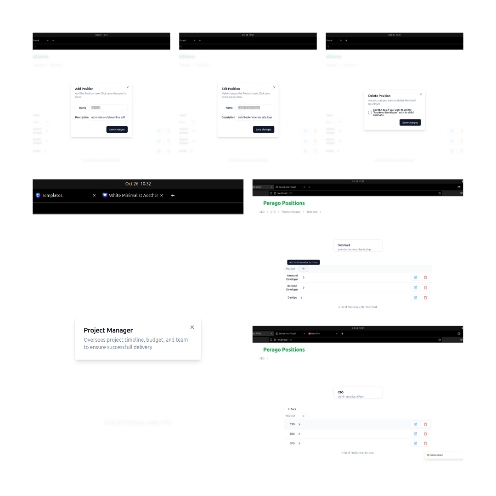

<p align="center">
  <a href="http://nestjs.com/" target="blank"></a>
</p>

[circleci-image]: https://img.shields.io/circleci/build/github/nestjs/nest/master?token=abc123def456
[circleci-url]: https://circleci.com/gh/nestjs/nest

## Description

perago internship project



## Project setup

```bash
$ npm install
# setup postgres db
$ docker compose up
# on windows use the command below
$ docker-compose up
```

## Compile and run the project

```bash
# run server
$ npm run start:dev

```

## Set up and Run frontend

```bash
# clone the svelte frontend repo
$ git clone https://github.com/HenokNegatu/perago-svelte-frontend.git

# naviage to the project
$ cd perago-svelte-frontend

# install dependencies
$ npm i

# run server
$ npm run dev
```

